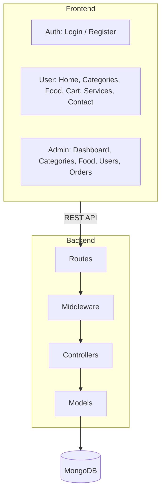
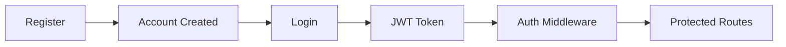
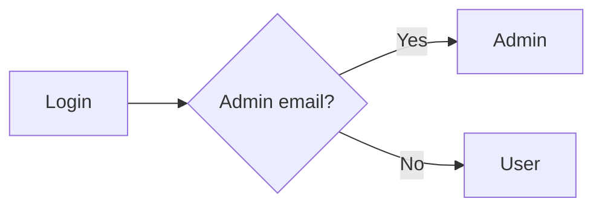
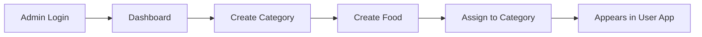
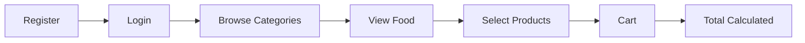

<!-- Animated Header -->
<p align="center">
  
</p>

<p align="center">
  
</p>

<p align="center">
  
  
  
  
  
  
</p>

<p align="center">
  <a href="#-features">Features</a> •
  <a href="#-screenshots">Screenshots</a> •
  <a href="#-tech-stack">Tech Stack</a> •
  <a href="#-architecture">Architecture</a> •
  <a href="#-installation">Installation</a> •
  <a href="#-api">API</a>
</p>

---

## 📖 About

A full-stack **Food Delivery Restaurant** web application built with the **MERN Stack**.

It has two parts:

| 👨‍💼 Admin Dashboard | 👤 User Application |
| --- | --- |
| Manage categories, food, users, and orders | Browse the menu, build a cart, and place orders |

---

## 🚀 Features

### 🔐 Authentication & Authorization

- User registration and login
- JWT-based authentication
- Protected routes (frontend and API)
- Role-based authorization (Admin / User)
- Admin account identified by a specific email; every other account is a normal user
- Invalid login credentials handling

### 👨‍💼 Admin vs 👤 User

| 👨‍💼 Admin Dashboard | 👤 User Application |
| --- | --- |
| 📂 Add, view, and delete **categories** | 🏠 Browse the home page and categories |
| 🍔 Add, view, and delete **food items** | 🍕 View food by category (image, name, description, price) |
| 🖼️ Upload food images | 🛒 Add items to the cart |
| 👥 View registered users and their info | 🧮 Automatic total price calculation |
| 📦 View all orders and purchased products | 📄 Services page |
| 💰 See order totals and order details | 📞 Contact page |

### 📂 Categories

Food items are displayed according to their assigned category.

> 🍕 Pizza • 🥤 Drinks • 🍔 Burgers • 🍽️ Dishes • 🥗 Salads • 🍲 Soups • 🍰 Desserts

### 🍔 Food Item Fields

```text
Name  |  Image  |  Price  |  Description  |  Category
```

### 🛒 Cart Example

| Product | Price | Quantity | Total |
| ------- | ----: | -------: | ----: |
| Pizza   |   $10 |        2 |   $20 |
| Burger  |    $8 |        1 |    $8 |
| **Total** |     |          | **$28** |

---

## 📸 Screenshots

> Put your images inside a `screenshots/` folder with these names (or change the paths below).

### 👤 User Application

| Home | Categories | Food |
| :---: | :---: | :---: |
|  |  |  |

| Cart | Login | Register |
| :---: | :---: | :---: |
|  |  |  |

### 👨‍💼 Admin Dashboard

| Dashboard | Food Management | Categories | Users |
| :---: | :---: | :---: | :---: |
|  |  |  |  |

---

## 🛠️ Tech Stack

### Frontend

<p>
  
</p>

- **React.js** — UI and reusable components
- **React Bootstrap** — Responsive UI components
- **Tailwind CSS** — Custom styling and responsive design
- **Font Awesome** — Icons
- **SweetAlert2** — Alerts and notifications

### Backend

<p>
  
</p>

- **Node.js** and **Express.js** — REST API
- **MongoDB** and **Mongoose** — Database and object modeling
- **JWT** — Authentication and authorization
- **Multer** — Image and file uploads
- **Validation** — User and application data checks

### Tools

<p>
  
</p>

---

## 🏗️ Architecture



### 🔑 Authentication Flow





### 🔄 Application Flow

**Admin**



**User**



---

## 📁 Project Structure

<details>
<summary><b>Backend</b></summary>

```text
backend/
├── controllers/
│   ├── authController.js
│   ├── foodController.js
│   ├── categoryController.js
│   ├── userController.js
│   └── orderController.js
├── models/
│   ├── User.js
│   ├── Food.js
│   ├── Category.js
│   └── Order.js
├── routes/
│   ├── authRoutes.js
│   ├── foodRoutes.js
│   ├── categoryRoutes.js
│   ├── userRoutes.js
│   └── orderRoutes.js
├── middleware/
│   └── authMiddleware.js
├── config/
│   └── database.js
└── server.js
```

</details>

<details>
<summary><b>Frontend</b></summary>

```text
frontend/
├── components/
│   ├── Navbar
│   ├── Footer
│   ├── FoodCard
│   ├── Category
│   └── ...
├── pages/
│   ├── Home
│   ├── Login
│   ├── Register
│   ├── Services
│   ├── Contact
│   ├── Cart
│   └── Admin
├── context/
│   └── StoreContext
└── App.jsx
```

</details>

---

## 🔒 Security

- JWT authentication
- Protected API routes
- Authorization middleware
- Admin / User role separation
- Protected Admin Dashboard
- Server-side authorization checks

---

## ⚙️ Installation

**1. Clone the repository**

```bash
git clone https://github.com/omar-rehann/food-delivery-restaurant.git
cd food-delivery-restaurant
```

**2. Backend**

```bash
cd backend
npm install
```

Create a `.env` file:

```env
PORT=4000
MONGODB_URI=your_mongodb_connection_string
JWT_SECRET=your_jwt_secret
```

```bash
npm run dev
```

**3. Frontend** (in a new terminal)

```bash
cd frontend
npm install
npm run dev
```

---

## 🌐 API

| Method | Endpoint | Description |
| :---: | --- | --- |
| `POST` | `/api/auth/register` | Register a new user |
| `POST` | `/api/auth/login` | Login and get a JWT |
| `POST` | `/api/category/add` | Add a category |
| `GET` | `/api/category/list` | List categories |
| `DELETE` | `/api/category/remove` | Delete a category |
| `POST` | `/api/food/addfood` | Add a food item |
| `GET` | `/api/food/list` | List food items |
| `PUT` | `/api/food/updatefood` | Update a food item |
| `DELETE` | `/api/food/removefood` | Delete a food item |
| `GET` | `/api/user/list` | List users (admin) |
| `GET` | `/api/order/list` | List orders (admin) |
| `POST` | `/api/order/create` | Create an order |

---

## 🎯 Project Goals

Built to practice and demonstrate real-world **MERN Stack** development:

- React frontend development and state management
- Node.js and Express REST APIs
- MongoDB database design
- Authentication and authorization
- CRUD operations and image uploads
- Admin dashboard, user, and order management

---

## 🚧 Future Improvements

- [ ] 💳 Online payment integration
- [ ] 📍 Order tracking
- [ ] 🔔 Notifications
- [ ] ⭐ Food reviews and ratings
- [ ] ❤️ Favorite products
- [ ] 📦 Advanced order status
- [ ] 📊 Advanced admin analytics
- [ ] 🔎 Food search
- [ ] 🏷️ Discounts and coupons

---

## 👨‍💻 Author

<p align="center">
  <b>Omar Rehan</b><br/>
  Full-Stack Developer
</p>

<p align="center">
  <a href="https://github.com/omar-rehann"></a>
  <a href="https://www.linkedin.com/in/omar-rehann"></a>
  <a href="https://omar-rehann.github.io/Omar-Rehann/"></a>
</p>

<p align="center">
  
</p>